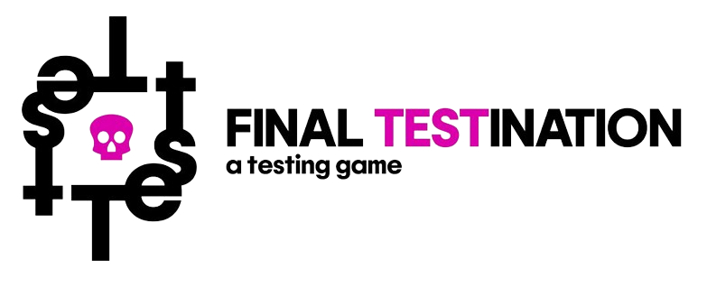

<h1 align="center">
  <br>
  
</h1>

<h4 align="center">"The Final Testination" is an open-source gamified web application created by <a href="https://www.unige.it">Unige</a> students.</h4>


<p align="center">
  <a href="#key-features">Key Features</a>•
  <a href="#how-to-use">How To Use</a> •
  <a href="#run-locally"> Run Locally </a>•
  <a href="#run-tests-locally"> Run test locally </a>•
  <a href="#download">Download</a> •
  <a href="#emailware">Emilware</a>•
  <a href="#license">License</a>
</p>


## Key Features

- **Login with Google**: Easily sign in using your Google account.
- **Email registration**: Register with a personal email address for access.
- **Level system**: 4 pre-existing levels with the option to add new ones.
- **Hints feature**: Get helpful hints to overcome challenges and progress.
- **User profile**: Track your completed levels and time spent.
- **Leaderboard**: Compare your performance with others on the leaderboard.
Support

## How To Use

To clone and run this application, you'll need [Git](https://git-scm.com) and [Node.js](https://nodejs.org/en/download/) (which comes with [npm](http://npmjs.com)) installed on your computer. From your command line:

```bash
# Clone this repository
$ git clone https://github.com/Camo-02/The-Final-Testination

# Go into the repository
$ cd The-Final-Testination

---cambiare ?---
# Install dependencies
$ npm install

# Run the app
$ npm start
```

> **Note**
> If you're using Linux Bash for Windows, [see this guide](https://www.howtogeek.com/261575/how-to-run-graphical-linux-desktop-applications-from-windows-10s-bash-shell/) or use `node` from the command prompt.

## Run locally
A `.env` file is required in the root directory of the project. A `.env.sample` is available in the same directory with some sensible default values.

```sh
#### Run this first in one terminal and wait for the DB to start...
docker compose -f development.yml up # DB

#### ...then run this in a second terminal...
cd backend && ../scripts/addenv go run main.go # Backend

#### ...and then this in the third and last terminal
cd frontend && ../scripts/addenv npm run dev # Frontend
```

### Stop the compose

This command will stop the database

```sh
docker compose -f development.yml down
```

## Run tests locally

The following commands assume you are currently in the root of the project:

```sh
#### In one terminal
docker compose -f development.yml up

#### In another terminal
cd backend && ../scripts/addenv go test ./...

#### In a third terminal
cd frontend
npm i
../scripts/addenv npm run dev

#### In a fourth terminal
cd frontend
../scripts/addenv npm run build:test && ../scripts/addenv npm run host
# If you want to run all the tests from the cli run this in another terminal:
../scripts/addenv npm run cypress # add ` -- -b <browser-name>` (or path) to run on a specific broser (e.g. `-- -b chrome`). 
# There's a specific shortcut for chrome: `npm run cypress:chrome`
# If you only want to run a specific type of tests, run:
../scripts/addenv npm run cypress:e2e # or cypress:component
# If you want to open cypress in a browser, then run
../scripts/addenv npm run cypress:open
```

**Note**: you have to `npm i` and `npm run dev` in order to have the dependencies and the `.svelte-kit` directory before running cypress tests, otherwise they will not work.

### psql

To run queries as strings against the local db, run:

```sh
psql -U postgres -p 5432 -h 127.0.0.1 -d final_testination -c "[query]"
```
## Download

You can [download](https://github.com/amitmerchant1990/electron-markdownify/releases/tag/v1.2.0) the latest installable version of Markdownify for Windows, macOS and Linux.

## Emailware

Markdownify is an [emailware](https://en.wiktionary.org/wiki/emailware). Meaning, if you liked using this app or it has helped you in any way, I'd like you send me an email at <bullredeyes@gmail.com> about anything you'd want to say about this software. I'd really appreciate it!

## Credits

This software uses the following open source packages:

- [Electron](http://electron.atom.io/)

## License

MIT

---
